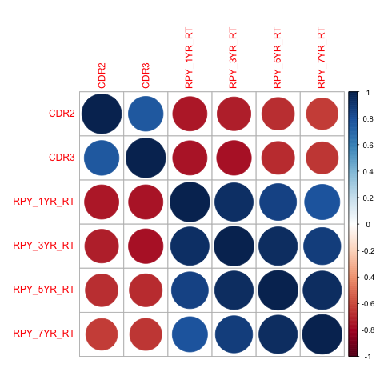
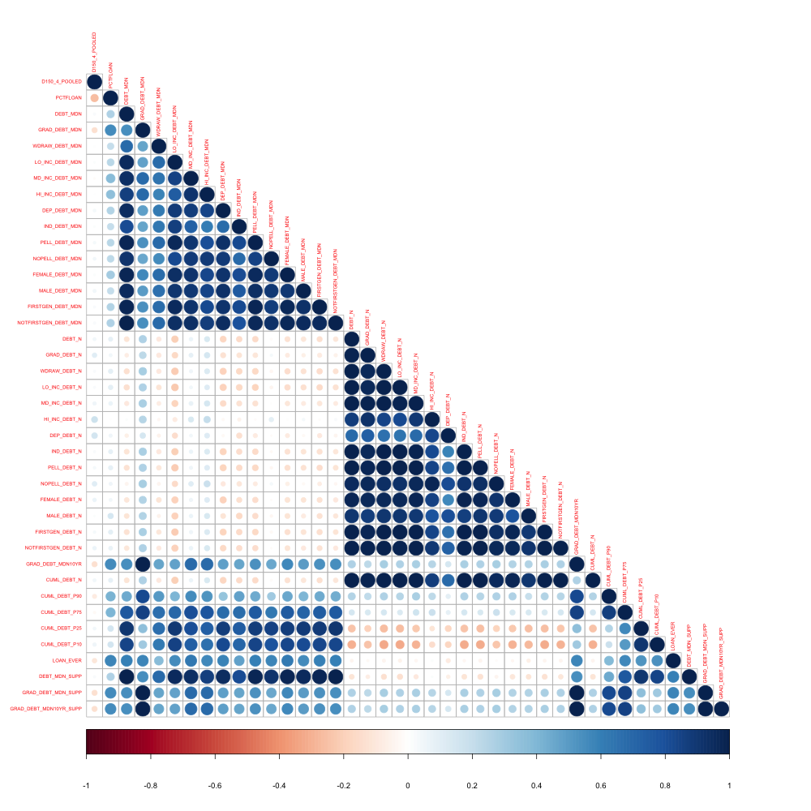
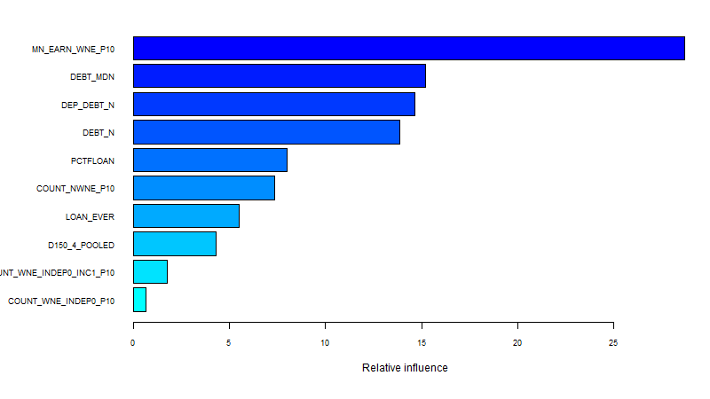

  
```{r setup, include=FALSE}
library(xtable)
library(caret)
options(xtable.comment = FALSE,
        xtable.table.placement="H")
knitr::opts_chunk$set(echo = FALSE, warning = FALSE, message = FALSE)

```

## Overview

- College Scorecard Data
- Loan Risks
- Data Preprocessing:
    * Variable Selection
    * Variable Imputation
- Models:
    * Logistic Regression
    * Gradient Boosting

## College Scorecard
- Released by U.S. Department of Education
- Data for over 7000 school providing higher education
- Includes student body demographics, financial status, earnings 
    * over a thousand features


## Loan Risks
- As a lender, credit institutions want to provide loans where the sudents are likely to pay off their debt
- We look into the financial aid and earnings data of students by university to gauge with universities have _safe_ borrowers

## Data Preprocessing: Variable Selection
- To measure the _risk_ of a school, we looked into default and repayment rate variables
- However, they're all highly correlated so we used the industry standard (3 year default rate)
```{r, out.width = "300px", echo=FALSE, fig.align = "center", fig.cap = "Correlation Matrix"}

```

## Data Preprocessing: Variable Selection
- Now that we have our label, we need to choose our features
- Also very highly correlated, so we choose the 10 that captured most variance
```{r, out.width = "350px", echo=FALSE, fig.align = "center", fig.cap = "Financial Correlation Matrix"}

```

## Data Preprocessing: Variable Imputation
- Samples or Features with over 30% missing values were excluded from our analysis
- Features with NULL values were set to 0
- Features with NA or PrivacySupressed were imputed with k-nearest neighbors 

## Models: Logistic Regression
- Given a binary output variable Y,  model the conditional probability  
$$ Pr\left(Y=1\,\middle|\,X = x\right) $$
as a function of _x_
- Any unknown parameters are estimated by maximum likelihood
- Formally:
$$ p(x) = \frac{e^{\beta_0+x\cdot\beta}}{1 + e^{\beta_0+x\cdot\beta}} $$

## Models: Gradient Boosting
- Core idea: train weak learners iteratively
- Build next model by adding an estimator _e_ to the previous
$$M_{i + 1}(x) = M_{i}(x) + e(x) \approx y$$
$$ e(x) = y - M_i(x)$$
- _e_ is essentially modeling the residuals 
- Usually use decision trees

## Models:
- Logistic regression is used for classification problems while gradient boosting is used for regression ones
- To compare the two:
    * logistic regression predicts whether or not default rate is above 15% 
    * gradient boosting predicts the default rate which is then binarized with the same labeling scheme

## Results and Conclusion
- In our decision trees, some features were more important than others:
```{r, out.width = "500px", echo=FALSE, fig.align = "center", fig.cap = "Financial Correlation Matrix"}

```

## Results and Conclusion
- F1 score, which combines both precision and recall, is higher for the gradient boosting machine
- In addition to providing more accuracy, this model provides more information (default rate vs label)
```{r results='asis', echo=FALSE}
stats.df <- read.csv("../data/logistic-result.csv")
load("../data/fitted-gbm.Rdata")
stats.df <- apply(stats.df, 2, mean)
cl <- as.factor(label > 0.15)
cp <- as.factor(pred > 0.15)
precision <- posPredValue(cp, cl)
recall <- sensitivity(cp, cl)
F1 <- (2 * precision * recall) / (precision + recall)
stats.df <- round(rbind(stats.df, c(precision, recall, F1)), digits = 3)
row.names(stats.df) <- c("Logistic Regression", "Gradient Boosting")
print(xtable(stats.df, caption = "Model Statistics"), type="html")
```

## Results and Conclusion 
- The gradient boosted model has a low mean absolute error of `r round(gbm.abse, digits = 3)`
- By observing 10 features of an unversity, we can pretty accurately predict the default rate of its alumni
- Credit institutions can use this information to decide whether to offer loans to students at a given university and at what rates

# Thank You

